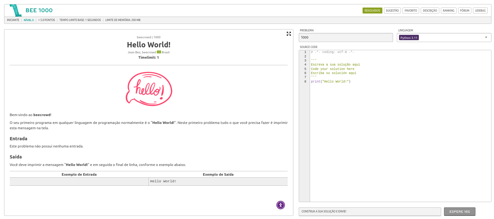
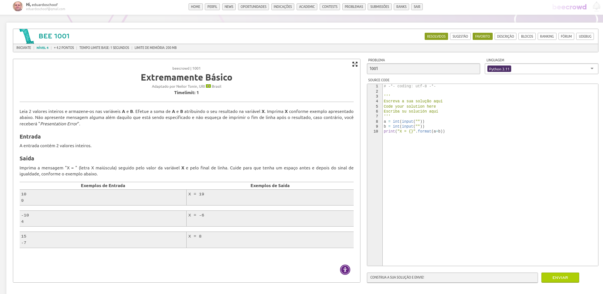
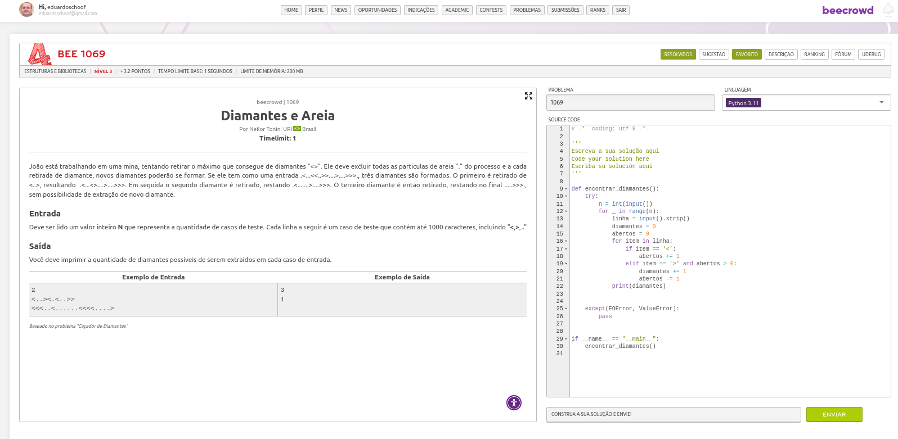
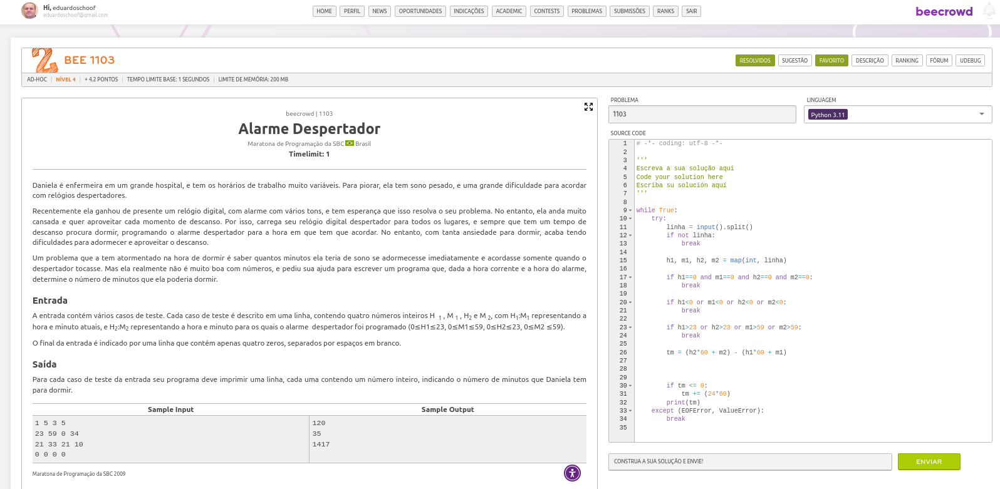
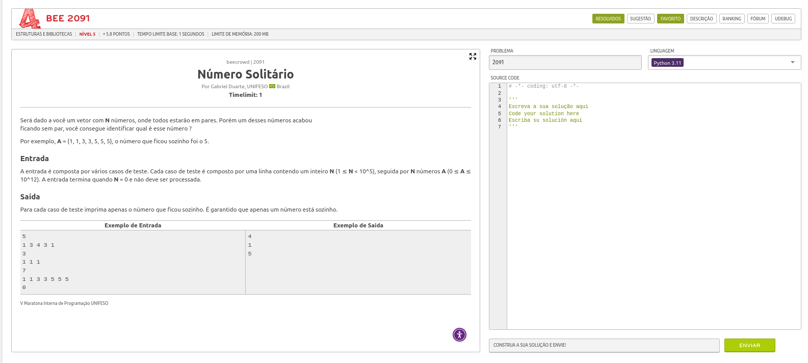

# 🐝 Beecrowd - Soluções em Python

Repositório com soluções de exercícios do Beecrowd (antigo URI Online Judge).

---

## 📋 Problemas Resolvidos


### 🔹 Bee 1000 - Hello World

**Descrição:** O seu primeiro programa em qualquer linguagem de programação normalmente é o "Hello World!". Neste primeiro problema tudo o que você precisa fazer é imprimir esta mensagem na tela.

**Entrada:**   
**Saída:** Hello World!

> 📄 [**Clique aqui para visualizar o código-fonte em Python**](bee1000.py)



---

### 🔹 Bee 1001 - Extremely Basic


**Descrição:** Leia 2 valores inteiros e armazene-os nas variáveis A e B. Efetue a soma de A e B atribuindo o seu resultado na variável X. Imprima X conforme exemplo apresentado abaixo.

**Entrada:** Dois valores inteiros.  
**Saída:** Imprima a soma de A e B com a mensagem "X = " (com um espaço antes e depois do sinal de igual).

> 📄 [**Clique aqui para visualizar o código-fonte em Python**](bee1001.py)



---

### 🔹 Bee 1069 - Contando Diamantes
**Descrição:** Dado uma string contendo apenas os caracteres '<' e '>', conte quantos diamantes podem ser formados. Um diamante é formado pela sequência "<>".

**Entrada:** A primeira linha contém N (número de casos de teste). Cada uma das N linhas seguintes contém uma string.  
**Saída:** Para cada caso de teste, imprima o número de diamantes que podem ser extraídos.

> 📄 [**Clique aqui para visualizar o código-fonte em Python**](bee1069.py)



---

### 🔹 Bee 1103 - Alarme Despertador
**Descrição:** Calcule o tempo em minutos entre o horário atual e o horário do alarme despertador.

**Entrada:** Cada linha contém 4 inteiros: H1 M1 H2 M2 (hora inicial, minuto inicial, hora final, minuto final). O teste termina quando H1=M1=H2=M2=0.  
**Saída:** Para cada caso, imprima o tempo em minutos até o alarme tocar.

> 📄 [**Clique aqui para visualizar o código-fonte em Python**](bee1103.py)



---

### 🔹 Bee 2091 - Número Solitário
**Descrição:** Dado um conjunto de números onde todos aparecem em pares exceto um, encontre o número solitário usando operação XOR.

**Entrada:** A primeira linha contém N (quantidade de números). A segunda linha contém N inteiros.  
**Saída:** Imprima o número que aparece apenas uma vez.

> 📄 [**Clique aqui para visualizar o código-fonte em Python**](bee2091.py)



---

## 🚀 Como Executar

```bash
python3 bee1001.py < entrada.txt
```

Ou execute diretamente e digite a entrada:
```bash
python3 bee1001.py
```

---

## 📁 Estrutura do Projeto

```
.
├── README.md
├── bee1000.py
├── bee1001.py
├── bee1069.py
├── bee1103.py
├── bee2091.py
└── images/
    ├── bee1000.png
    ├── bee1001.png
    ├── bee1069.png
    ├── bee1103.png
    └── bee2091.png
```

---

## 📝 Notas

- Todas as soluções foram testadas e aceitas no Beecrowd
- Linguagem: Python 3.10
- Para mais problemas, visite: [beecrowd.com.br](https://www.beecrowd.com.br/)
