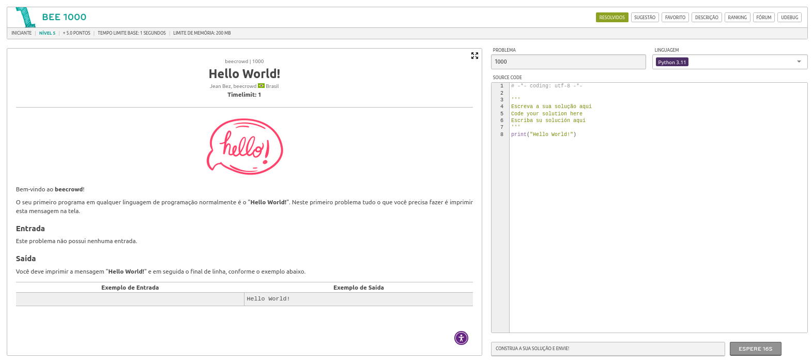
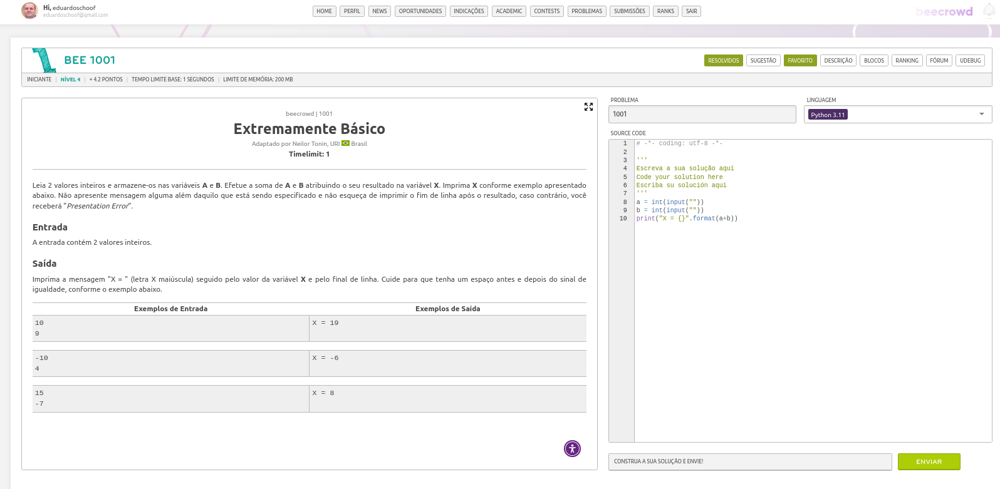
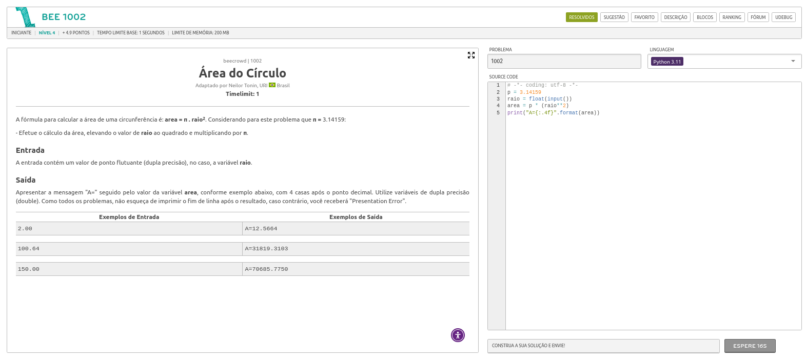
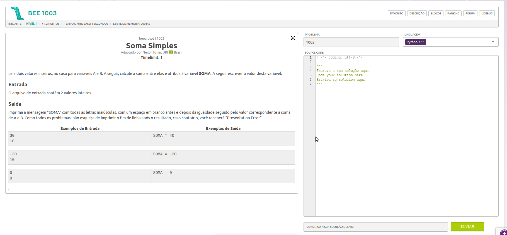
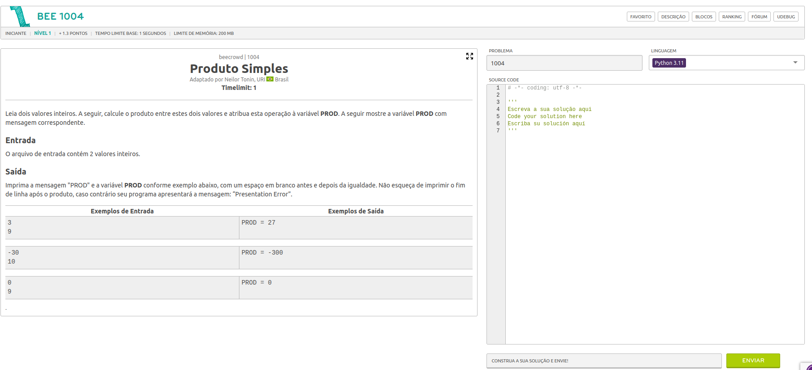
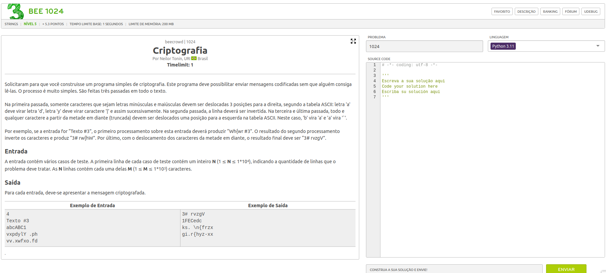
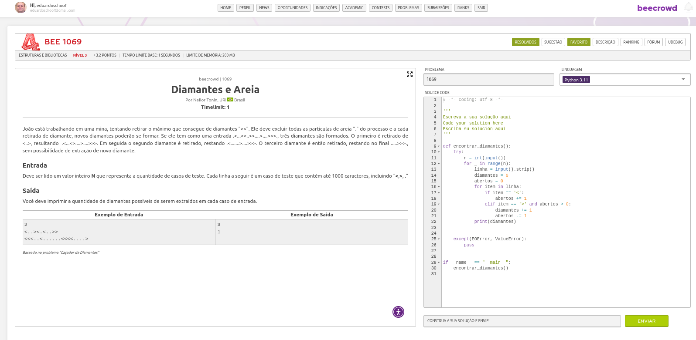
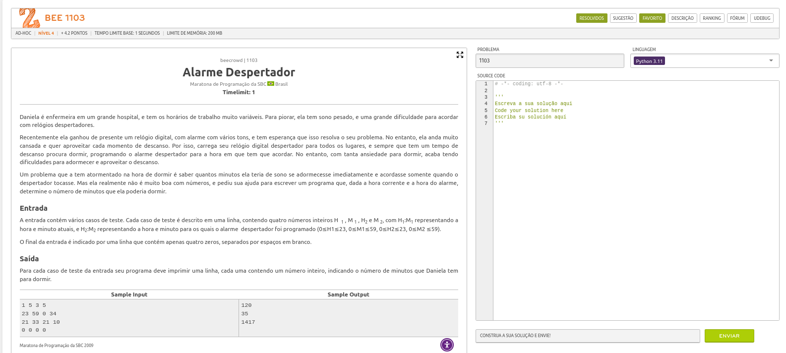
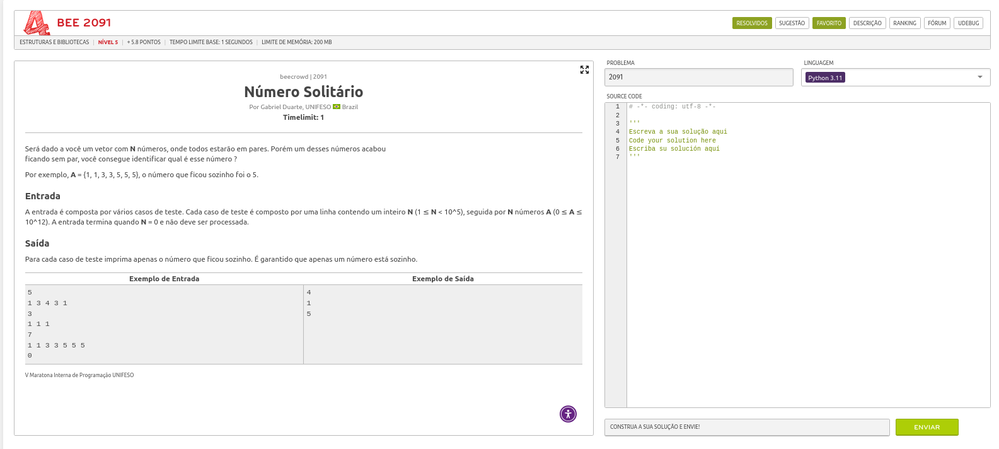

# 🐝 Beecrowd - Soluções em Python

Repositório com soluções de exercícios do Beecrowd (antigo URI Online Judge).

---

## 📋 Problemas Resolvidos


### 🔹 Bee 1000 - Hello World

**Descrição:** O seu primeiro programa em qualquer linguagem de programação normalmente é o "Hello World!". Neste primeiro problema tudo o que você precisa fazer é imprimir esta mensagem na tela.

**Entrada:**   
**Saída:** Hello World!

> 📄 [**Clique aqui para visualizar o código-fonte em Python**](bee1000.py)



---

### 🔹 Bee 1001 - Extremely Basic


**Descrição:** Leia 2 valores inteiros e armazene-os nas variáveis A e B. Efetue a soma de A e B atribuindo o seu resultado na variável X. Imprima X conforme exemplo apresentado abaixo.

**Entrada:** Dois valores inteiros.  
**Saída:** Imprima a soma de A e B com a mensagem "X = " (com um espaço antes e depois do sinal de igual).

> 📄 [**Clique aqui para visualizar o código-fonte em Python**](bee1001.py)



---

### 🔹 Bee 1002 - Área do Círculo


**Descrição:** 

A fórmula para calcular a área de uma circunferência é: area = π . raio2. Considerando para este problema que π = 3.14159:
Efetue o cálculo da área, elevando o valor de raio ao quadrado e multiplicando por π.


**Entrada:** A entrada contém um valor de ponto flutuante (dupla precisão), no caso, a variável raio.  

**Saída:** Apresentar a mensagem "A=" seguido pelo valor da variável area, conforme exemplo abaixo, com 4 casas após o ponto decimal. Utilize variáveis de dupla precisão (double). Como todos os problemas, não esqueça de imprimir o fim de linha após o resultado, caso contrário, você receberá "Presentation Error".

> 📄 [**Clique aqui para visualizar o código-fonte em Python**](bee1002.py)



---

### 🔹 Bee 1003 - Soma Simples


**Descrição:** 

Leia dois valores inteiros, no caso para variáveis A e B. A seguir, calcule a soma entre elas e atribua à variável SOMA. A seguir escrever o valor desta variável.


**Entrada:** A arquivo de entrada contém dois valores inteiros.

**Saída:** Imprima a mensagem "SOMA" com todas as letras maiúsculas, com um espaço em branco antes e depois da igualdade seguido pelo valor correspondente à soma de A e B. Como todos os problemas, não esqueça de imprimir o fim de linha após o resultado, caso contrário, você receberá "Presentation Error".

> 📄 [**Clique aqui para visualizar o código-fonte em Python**](bee1003.py)



---

### 🔹 Bee 1004 - Produto Simples


**Descrição:** 

Leia dois valores inteiros. A seguir, calcule o produto entre estes dois valores e atribua esta operação à variável PROD. A seguir mostre a variável PROD com mensagem correspondente.   


**Entrada:** A arquivo de entrada contém dois valores inteiros.

**Saída:** Imprima a mensagem "PROD" e a variável PROD conforme exemplo abaixo, com um espaço em branco antes e depois da igualdade. Não esqueça de imprimir o fim de linha após o produto, caso contrário seu programa apresentará a mensagem: “Presentation Error”.

> 📄 [**Clique aqui para visualizar o código-fonte em Python**](bee1004.py)



---

### 🔹 Bee 1024 - Criptografia


**Descrição:** 

Solicitaram para que você construisse um programa simples de criptografia. Este programa deve possibilitar enviar mensagens codificadas sem que alguém consiga lê-las. O processo é muito simples. São feitas três passadas em todo o texto.

Na primeira passada, somente caracteres que sejam letras minúsculas e maiúsculas devem ser deslocadas 3 posições para a direita, segundo a tabela ASCII: letra 'a' deve virar letra 'd', letra 'y' deve virar caractere '|' e assim sucessivamente. Na segunda passada, a linha deverá ser invertida. Na terceira e última passada, todo e qualquer caractere a partir da metade em diante (truncada) devem ser deslocados uma posição para a esquerda na tabela ASCII. Neste caso, 'b' vira 'a' e 'a' vira '`'.

Por exemplo, se a entrada for “Texto #3”, o primeiro processamento sobre esta entrada deverá produzir “Wh{wr #3”. O resultado do segundo processamento inverte os caracteres e produz “3# rw{hW”. Por último, com o deslocamento dos caracteres da metade em diante, o resultado final deve ser “3# rvzgV”. 

**Entrada:** A entrada contém vários casos de teste. A primeira linha de cada caso de teste contém um inteiro N (1 ≤ N ≤ 1*104), indicando a quantidade de linhas que o problema deve tratar. As N linhas contém cada uma delas M (1 ≤ M ≤ 1*103) caracteres.

**Saída:** Para cada entrada, deve-se apresentar a mensagem criptografada.

> 📄 [**Clique aqui para visualizar o código-fonte em Python**](bee1024.py)



---


### 🔹 Bee 1069 - Contando Diamantes
**Descrição:** Dado uma string contendo apenas os caracteres '<' e '>', conte quantos diamantes podem ser formados. Um diamante é formado pela sequência "<>".

**Entrada:** A primeira linha contém N (número de casos de teste). Cada uma das N linhas seguintes contém uma string.  

**Saída:** Para cada caso de teste, imprima o número de diamantes que podem ser extraídos.

> 📄 [**Clique aqui para visualizar o código-fonte em Python**](bee1069.py)



---

### 🔹 Bee 1103 - Alarme Despertador
**Descrição:** Calcule o tempo em minutos entre o horário atual e o horário do alarme despertador.

**Entrada:** Cada linha contém 4 inteiros: H1 M1 H2 M2 (hora inicial, minuto inicial, hora final, minuto final). O teste termina quando H1=M1=H2=M2=0.  

**Saída:** Para cada caso, imprima o tempo em minutos até o alarme tocar.

> 📄 [**Clique aqui para visualizar o código-fonte em Python**](bee1103.py)



---

### 🔹 Bee 2091 - Número Solitário
**Descrição:** Dado um conjunto de números onde todos aparecem em pares exceto um, encontre o número solitário usando operação XOR.

**Entrada:** A primeira linha contém N (quantidade de números). A segunda linha contém N inteiros.  

**Saída:** Imprima o número que aparece apenas uma vez.

> 📄 [**Clique aqui para visualizar o código-fonte em Python**](bee2091.py)



---

## 🚀 Como Executar

```bash
python3 bee1001.py < entrada.txt
```

Ou execute diretamente e digite a entrada:
```bash
python3 bee1001.py
```

---

## 📁 Estrutura do Projeto

```
.
├── README.md
├── bee1000.py
├── bee1001.py
├── bee1002.py
├── bee1003.py
├── bee1004.py
├── bee1024.py
├── bee1069.py
├── bee1103.py
├── bee2091.py
└── images/
    ├── bee1000.png
    ├── bee1001.png
    ├── bee1002.png
    ├── bee1003.png
    ├── bee1004.png
    ├── bee1024.png
    ├── bee1069.png
    ├── bee1103.png
    └── bee2091.png
```

---

## 📝 Notas

- Todas as soluções foram testadas e aceitas no Beecrowd
- Linguagem: Python 3.11
- Para mais problemas, visite: [beecrowd.com.br](https://www.beecrowd.com.br/)
